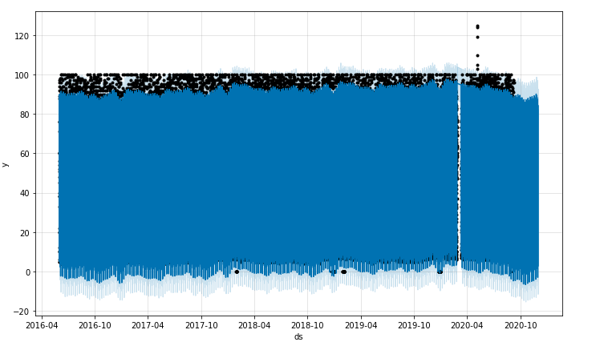

# Mercado_de_Prophet
Uses the Facebook Prophet library and pandas data mining tools to find correlation between seasonal search traffic and volatility for Mercado Libre.

---
## Technologies

Language: Python 3.9.12

Libraries used:

[Pandas](https://pandas.pydata.org/pandas-docs/stable/index.html) - For the creation and visualization of Data Frames

[Jupyter Labs](https://jupyter.org/) - An ipython kernel for interactive computing in python

[PyViz hvPlot](https://hvplot.holoviz.org/index.html) - A high level python library for interactive data visualization

[Facebook Prophet](https://facebook.github.io/prophet/) - Industry standard for predicting time-series models

## Usage

Open up your gitbash terminal and navigate to the location of the program files and activate your dev environment, after doing so open up jupyter labs by typing jupyter lab in gitbash.

## Highlights
--- 
near-term forecast for the popularity of MercadoLibre?

---

## Contributors

Created by Austin Means while in the UW FinTech Bootcamp
> Contact Info:
> email: austinmeans92@gmail.com|
> 
> [GitHub] (https://github.com/aimeans) |
> 